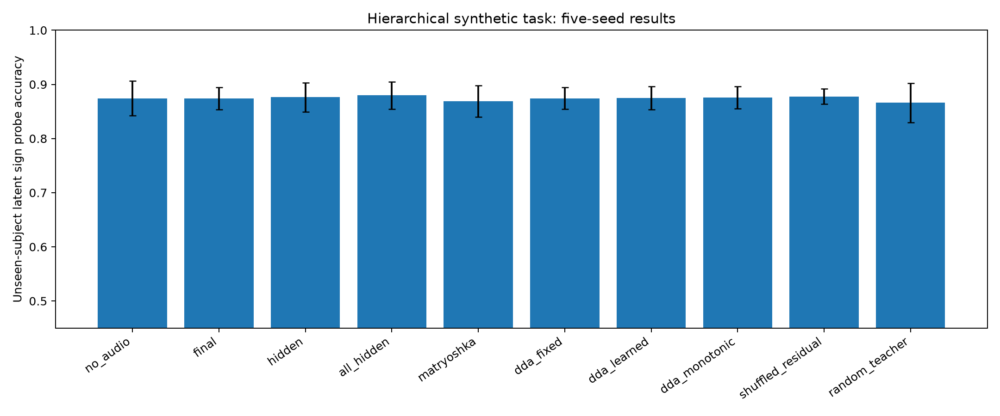

# Synthetic Validation

## Design

- Controlled data: three continuous latent variables (`z1` acoustic, `z2` phonetic, `z3` semantic), subject nuisance, noise, and disjoint subject/stimulus sets.
- EEG encoder: 4-layer pre-LN Transformer, 24 hidden units, 4 heads.
- Frozen audio teacher: 6 controlled residual layers.
- Evaluation: linear sign probes and ridge `R²` on unseen subjects and unseen stimuli.
- Seeds: 0–4 for every configuration; result unit is the seed, not a window.
- Run profile: preregistered 10-epoch first round.

## Main hierarchical result

| Method | Probe accuracy mean ± SD |
|---|---:|
| final state | 0.8743 ± 0.0206 |
| fixed hidden alignment | 0.8764 ± 0.0267 |
| DDA fixed | 0.8743 ± 0.0200 |
| DDA monotonic | 0.8757 ± 0.0206 |
| shuffled DDA | 0.8778 ± 0.0142 |

Paired seed-level permutation tests (unadjusted exploratory p-values):

- DDA monotonic − hidden: Δ=-0.0007, p=1.0000, paired standardized effect=-0.088.
- DDA monotonic − final: Δ=+0.0014, p=0.6215, effect=0.174.
- DDA monotonic − shuffled: Δ=-0.0021, p=0.8120, effect=-0.208.

## Counterexamples

- No hierarchy: DDA monotonic 0.6681 ± 0.0285; hidden 0.6785 ± 0.0282.
- Non-monotonic hierarchy: unconstrained learned DDA 0.8806 ± 0.0117; monotonic DDA 0.8840 ± 0.0144.
- Parallel and shuffled-teacher controls are recorded in `ablation_results.csv`.

## Falsification gates

| Gate | Result |
|---|---|
| DDA beats hidden and final in hierarchical data | FAIL |
| Correct order beats shuffled order | FAIL |
| No-hierarchy advantage is not larger than hierarchical advantage | PASS |
| Overall synthetic gate | **FAIL** |

The synthetic task validates implementation behavior only. It cannot establish that real EEG encoder depth corresponds to physiology or that an audio teacher has a true acoustic→semantic derivative hierarchy.

## Stage status

- Completed: 5-seed hierarchical comparison, no-hierarchy, non-monotonic, parallel, shuffled-order, and random-teacher controls.
- Failed: see gates above; failures are retained rather than overwritten.
- Missing: noise/delay/data-scale grids beyond the first-round configuration.
- Key findings: numerical values above are generated from `outputs/synthetic/results.csv`.
- Blocking issues: novelty failure prevents treating a synthetic pass as sufficient evidence.
- Decision: **FAIL** for the controlled synthetic mechanism; real-data claims remain not run.
